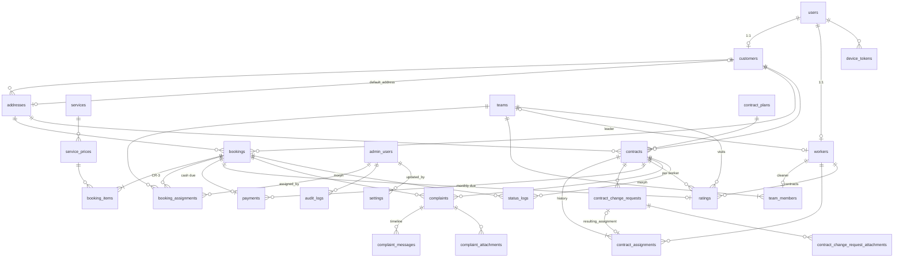

# لمعة — Phase 2: قاعدة البيانات

> الحالة: **مكتمل ومُتحقق منه** على SQLite (للاختبارات) وMariaDB 10.4 (XAMPP — نفس محرك الإنتاج MySQL/MariaDB).
> القرارات غير المحسومة نُفذت بالقيم الافتراضية في `backend/config/agency.php` (انظر docs/01 القسم 11).

## المخرجات

| الملف | المحتوى |
|---|---|
| `backend/database/migrations/` | 6 ملفات Migration للمشروع (السادس: فرق الزيارات — CR-3) + جداول Laravel/Sanctum/Notifications |
| `backend/app/Enums/` | 16 Enum — المصدر الوحيد لكل الحالات، بنصوص عربية/إنجليزية في `lang/*/enums.php` |
| `backend/app/Models/` | 24 Model بالعلاقات والـ casts والـ scopes |
| `backend/app/Models/Concerns/` | `HasDocumentNumber` · `HasStatusLogs` · `BelongsToBookingOrContract` |
| `backend/app/Support/Settings.php` | قراءة الإعدادات: جدول `settings` أولاً ثم `config/agency.php` |
| `backend/database/seeders/` | `CatalogSeeder` (خدمات، أسعار، باقات) · `AdminUserSeeder` · `DemoSeeder` (local فقط) |
| `backend/tests/Feature/` | 20 اختباراً عند نهاية Phase 2 (المجموع الحالي في docs/03) |

## الجداول (26 جدول مشروع بعد CR-3 + جداول Laravel: notifications, personal_access_tokens, sessions, jobs, cache)



## قواعد السلامة المفروضة

| القاعدة | أين تُفرض |
|---|---|
| الدفعة / التقييم / الشكوى مرتبطة بزيارة **أو** عقد (واحد بالضبط) | `CHECK` في MySQL/MariaDB + `BelongsToBookingOrContract` في كل المحركات |
| درجات التقييم بين 1 و5 | `CHECK` في MySQL/MariaDB (والتحقق من المدخلات في Phase 3) |
| تقييم واحد لكل زيارة، وتقييم واحد لكل عاملة في العقد | `UNIQUE (booking_id)` · `UNIQUE (contract_id, worker_id)` |
| لا حذف لعميل/عاملة/خدمة لها طلبات | `restrictOnDelete` على المفاتيح الأجنبية |
| العنوان والباقة والسعر وقت الطلب لا تتغير لاحقاً | `address_snapshot` · `plan_snapshot` · `service_name_snapshot` + `unit_price` |
| `role` و `status` للمستخدم لا تُسند من مدخلات التطبيق | خارج `$fillable` (وفي وضع strict ترمي خطأ) |
| رقم الهوية للعاملة مشفّر ومخفي من JSON | `encrypted` cast + `$hidden` |
| كلمات المرور مشفّرة | `hashed` cast |
| الملاحظات الداخلية في الشكاوى لا تظهر للعميل | `ComplaintMessage::visibleToCustomer()` |
| عضو الفريق يرى زيارات فريقه فقط، والخادمة عقودها فقط (الإسناد المرفوض لا يُحتسب) | `Booking::assignedTo()` · `Contract::currentlyAssignedTo()` |
| أرقام مقروءة فريدة دون تعارض | `HasDocumentNumber`: `BK-` `CT-` `RQ-` `CM-` + السنة + الـ id |
| أسماء ثابتة في أعمدة morph | `Relation::enforceMorphMap` في `AppServiceProvider` |

## ما تركناه لـ Phase 3 (عن قصد)
- **قواعد الانتقال بين الحالات** (`BookingStateMachine`, `ContractStateMachine`) — الـ Enums جاهزة لها.
- **منع تداخل إسنادات العاملة** (`AvailabilityService`) — يحتاج منطق تواريخ وقفل داخل Transaction، ولا يمكن التعبير عنه بقيد في قاعدة البيانات.
- **التحقق من المدخلات** (Form Requests) والصلاحيات (Policies).

## التشغيل

```bash
cd backend
composer install
cp .env.example .env        # ثم عدّل DB_* (أو اجعل DB_CONNECTION=sqlite للتجربة السريعة)
php artisan key:generate
php artisan migrate:fresh --seed
php artisan test
```

- **بيئة local:** يُنشأ حساب إدارة تجريبي `admin@lamaa.test` وبيانات تجريبية (عملاء، عاملات، زيارات، عقود، طلبات استبدال، شكاوى). كلمة المرور في `AdminUserSeeder`.
- **الإنتاج:** يجب تعيين `SEED_ADMIN_EMAIL` و `SEED_ADMIN_PASSWORD` في `.env`، ولا تعمل البيانات التجريبية.
- `.env` المحلي حالياً على SQLite حتى لا يلزم تشغيل MySQL؛ `.env.example` على MySQL.
